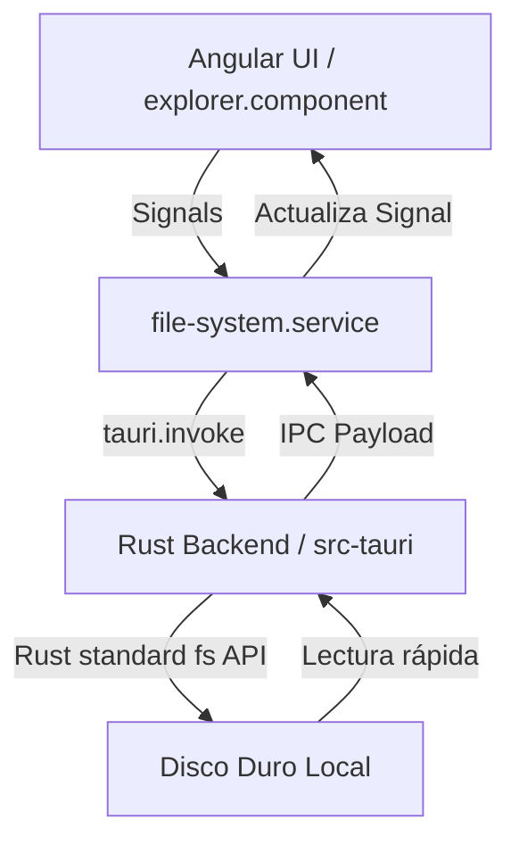

# Arquitectura del Proyecto: Atenea (Clon de Obsidian Local-First)

Este documento sirve como la fuente de verdad técnica del proyecto. Proporciona la estructura del sistema, los principios de diseño y el estado actual para que cualquier programador u agente de Inteligencia Artificial (LLM) pueda entender y continuar el desarrollo de inmediato.

---

## 1. Visión General y Pila Tecnológica

Atenea es una aplicación de gestión de conocimiento personal (PKM) "local-first" y de ultra-bajo consumo de recursos.

*   **Contenedor de Escritorio:** Tauri v2 (Rust) para un acceso rápido y directo a la API del sistema de archivos local, con un consumo mínimo de memoria (< 50MB en reposo).
*   **Capa del Frontend:** Angular 21 (TypeScript), utilizando standalone components y reactividad pura basada en **Signals**.
*   **Editor de Texto:** CodeMirror 6 (mediante un wrapper personalizado).
*   **Visualización de Red:** `ngx-graph` para la vista de grafo de notas bidireccionales.

---

## 2. Flujo de Datos y Comunicación IPC

El frontend no tiene acceso directo a APIs de node.js o comandos del sistema operativo. Toda interacción con el disco local se hace a través de la comunicación IPC segura de Tauri:

---

## 3. Estructura de Directorios

El repositorio se organiza de la siguiente manera:

*   **`src/`** (Angular Frontend)
    *   `app/core/`: Servicios esenciales singleton, utilidades, guardias e interceptores.
        *   `services/file-system.service.ts`: Único servicio responsable de la comunicación IPC con Rust para el disco local.
    *   `app/features/`: Módulos de funcionalidades de la aplicación (desacoplados).
        *   `explorer/`: Explorador de carpetas y archivos.
        *   `editor/`: Editor Markdown CodeMirror 6.
        *   `graph/`: Renderizador del grafo de notas.
    *   `app/shared/`: Componentes y directivas reutilizables.
*   **`src-tauri/`** (Tauri Backend)
    *   `src/`: Código fuente de Rust.
        *   `main.rs` o `lib.rs`: Definición de los comandos de Tauri expuestos al IPC.

---

## 4. Principios de Diseño para IA y Desarrolladores

Para mantener la base de código limpia, mantenible y portable para futuras sesiones de LLMs:

1.  **Reactividad Limpia (Signals):** Usar Signals en Angular para todo el estado reactivo local. Evitar observables complejos de RxJS a menos que sea estrictamente necesario para flujos de datos asíncronos asilados (como eventos debounce).
2.  **Bajo Acoplamiento:** Los componentes no deben importar dependencias cruzadas de otros módulos. Todo debe comunicarse vía servicios o interfaces bien definidas.
3.  **Tipado Estricto:** Nunca usar `any`. Todas las respuestas IPC de Rust deben tener una interfaz TypeScript equivalente en el frontend (`src/app/core/models/`).
4.  **Operaciones en Rust:** Todo escaneo de carpetas, lectura pesada e indexación de backlinks inicial se realiza en Rust para aprovechar el paralelismo de la CPU y la velocidad de acceso directo.
