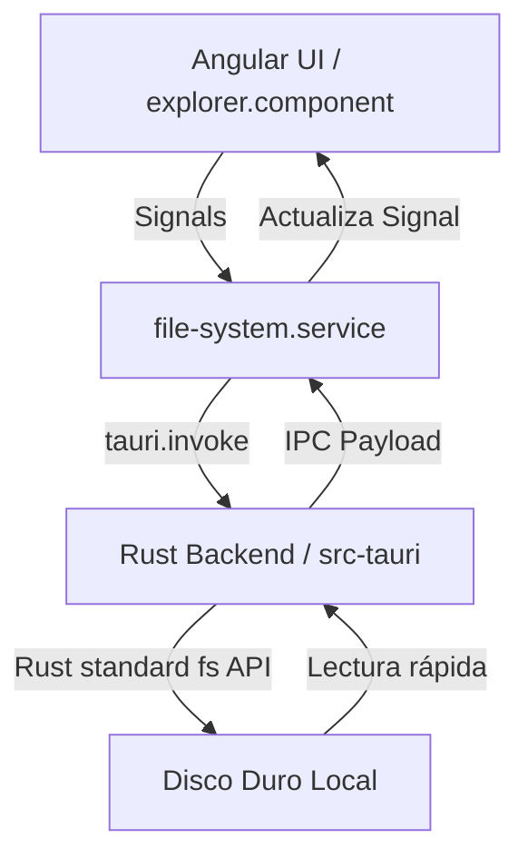
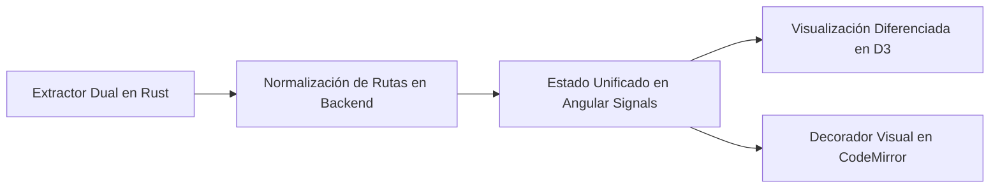

# Arquitectura del Proyecto: Atenea (Clon de Obsidian Local-First)

Este documento sirve como la fuente de verdad técnica del proyecto. Proporciona la estructura del sistema, los principios de diseño y el estado actual para que cualquier programador u agente de Inteligencia Artificial (LLM) pueda entender y continuar el desarrollo de inmediato.

---

## 1. Visión General y Pila Tecnológica

Atenea es una aplicación de gestión de conocimiento personal (PKM) "local-first" y de ultra-bajo consumo de recursos.

*   **Contenedor de Escritorio:** Tauri v2 (Rust) para un acceso rápido y directo a la API del sistema de archivos local, con un consumo mínimo de memoria (< 50MB en reposo).
*   **Capa del Frontend:** Angular 21 (TypeScript), utilizando standalone components y reactividad pura basada en **Signals**.
*   **Editor de Texto:** CodeMirror 6 (mediante un wrapper personalizado).
*   **Visualización de Red:** `ngx-graph` para la vista de grafo de notas bidireccionales.

---

## 2. Flujo de Datos y Comunicación IPC

El frontend no tiene acceso directo a APIs de node.js o comandos del sistema operativo. Toda interacción con el disco local se hace a través de la comunicación IPC segura de Tauri:

---

## 3. Estructura de Directorios

El repositorio se organiza de la siguiente manera:

*   **`src/`** (Angular Frontend)
    *   `app/core/`: Servicios esenciales singleton, utilidades, guardias e interceptores.
        *   `services/file-system.service.ts`: Único servicio responsable de la comunicación IPC con Rust para el disco local.
    *   `app/features/`: Módulos de funcionalidades de la aplicación (desacoplados).
        *   `explorer/`: Explorador de carpetas y archivos.
        *   `editor/`: Editor Markdown CodeMirror 6.
        *   `graph/`: Renderizador del grafo de notas.
    *   `app/shared/`: Componentes y directivas reutilizables.
*   **`src-tauri/`** (Tauri Backend)
    *   `src/`: Código fuente de Rust.
        *   `main.rs` o `lib.rs`: Definición de los comandos de Tauri expuestos al IPC.

---

## 4. Principios de Diseño para IA y Desarrolladores

Para mantener la base de código limpia, mantenible y portable para futuras sesiones de LLMs:

1.  **Reactividad Limpia (Signals):** Usar Signals en Angular para todo el estado reactivo local. Evitar observables complejos de RxJS a menos que sea estrictamente necesario para flujos de datos asíncronos asilados (como eventos debounce).
2.  **Bajo Acoplamiento:** Los componentes no deben importar dependencias cruzadas de otros módulos. Todo debe comunicarse vía servicios o interfaces bien definidas.
3.  **Tipado Estricto:** Nunca usar `any`. Todas las respuestas IPC de Rust deben tener una interfaz TypeScript equivalente en el frontend (`src/app/core/models/`).
4.  **Operaciones en Rust:** Todo escaneo de carpetas, lectura pesada e indexación de backlinks inicial se realiza en Rust para aprovechar el paralelismo de la CPU y la velocidad de acceso directo.

---

## 5. Directrices de Publicación y Control de Cambios (CRÍTICO para Agentes e IA)

Para asegurar la estabilidad del proyecto y el control del usuario, cualquier agente de Inteligencia Artificial (LLM) o desarrollador debe cumplir estrictamente las siguientes directrices en esta base de código:

> [!IMPORTANT]
> **POLÍTICA DE LANZAMIENTOS Y TAGS (PROHIBICIÓN DE AUTOPUBLICACORES):**
> *   **PROHIBIDO** crear o empujar etiquetas de git (`git tag v*`) de forma autónoma.
> *   **PROHIBIDO** crear o disparar lanzamientos ("Releases") en GitHub sin confirmación explícita del usuario.
> *   Antes de realizar cualquier lanzamiento, compilación de versión oficial o etiquetado en Git, el desarrollador o agente **DEBE PREGUNTAR PRIMERO** al usuario y recibir un "Sí" o aprobación expresa.
> *   Las confirmaciones intermedias (commits) para guardar progreso en la rama `main` están permitidas para evitar la pérdida de trabajo, pero los despliegues formales a producción son decisión exclusiva del usuario.

---

## 6. Diseño y Estrategia del Motor de Enlaces Híbrido (WikiLinks + Markdown)

Este apartado detalla la arquitectura estratégica recomendada para implementar la compatibilidad dual de enlaces, mitigando sus riesgos de fragilidad y asegurando un comportamiento reactivo y preventivo de cara al usuario.

### 6.1 Recomendación del Experto: Híbrido por Defecto y Configurable

Se propone un enfoque **Configurable con Modo Híbrido activo por defecto**. Esto permite:
1.  **Compatibilidad Inmediata ("Efecto Wow"):** Un usuario que abre un repositorio con documentación Markdown clásica en Atenea verá su red de conocimiento mapeada en el grafo en milisegundos sin cambiar una sola línea.
2.  **Control de Usuario:** Usuarios puristas del Zettelkasten pueden configurar el espacio a "Modo Obsidian" (únicamente WikiLinks), mientras que repositorios técnicos pueden limitar la edición a "Modo Estándar".

---

### 6.2 Estrategias de Mitigación de Enlaces Rotos (Resolución Preventiva y Reactiva)

Para resolver el problema de la "fragilidad" de los enlaces Markdown estándar ante traslados o renombrados de archivos, se plantean tres mecanismos integrados en la arquitectura:

#### A. Refactorización Preventiva en Rust (IDE-like Link Sync)
*   **Mecanismo:** El backend en Rust mantiene el índice completo de relaciones en memoria. Cuando el usuario renombra o traslada un archivo `.md` en el explorador lateral:
    1.  Rust localiza en milisegundos todos los archivos que contienen enlaces estándar que apuntaban al archivo original.
    2.  Calcula de forma dinámica la nueva ruta relativa basada en las nuevas ubicaciones.
    3.  Aplica una **transacción de refactorización** sobre dichos archivos modificando el texto del enlace en disco de forma invisible y segura.

#### B. Detección y Creación Reactiva de Notas Fantasma
*   **Resaltado Visual en el Editor:** El parser de CodeMirror 6 aplica un estilo CSS distintivo a los enlaces. Si se detecta que un enlace estándar apunta a un archivo que no existe físicamente (p. ej. `[Config](../missing.md)`), el editor lo dibuja con un subrayado punteado rojo carmesí.
*   **Resolución Dinámica:** Ctrl + Clic sobre el enlace roto (o doble clic sobre el nodo fantasma rojo en el Grafo de D3) abre un diálogo flotante: *"Este enlace está roto. ¿Deseas crear la nota en la ruta especificada?"*. Si el usuario acepta, Rust crea de inmediato el archivo y las carpetas intermedias en disco, resolviendo la inconsistencia al instante.

#### C. Panel de Diagnóstico de Enlaces (Link Linting Console)
*   Un panel colapsable o pestaña de diagnóstico que lista de forma ordenada todos los enlaces rotos en la bóveda, sirviendo como un valioso validador de documentación técnica para desarrolladores.

---

### 6.3 Estrategia de Implementación Técnica en Fases

1.  **Fase 1: Extractor Dual en Rust (src-tauri/src/lib.rs):**
    *   Diseñar una estructura `LinkExtractor` que compile dos patrones optimizados (`lazy_static` regex) para procesar concurrentemente el contenido de cada archivo.
    *   **Normalización de Rutas:** Cuando Rust detecta un enlace Markdown, toma la ruta base de la nota origen, concatena la ruta relativa del enlace y genera un *Path Canonicalizado* (absoluto con respecto a la bóveda) para relacionarlo unívocamente en el índice.

2.  **Fase 2: Interfaz Reactiva y Diferenciada:**
    *   El servicio central en TypeScript (`BacklinksService`) recibe los bordes del grafo con una nueva propiedad `type: 'wiki' | 'standard'`.
    *   **Estética en el Grafo:** El componente de D3 dibuja las aristas WikiLinks como líneas continuas lavanda y los enlaces estándar como líneas discontinuas/punteadas gris claro, haciendo que el grafo sea sumamente informativo.

3.  **Fase 3: Extensiones del Editor (CodeMirror 6):**
    *   Escribir un plugin de decoración visual para CodeMirror 6 que escanee el texto del viewport activo y aplique interactividad (Ctrl+Clic) tanto a enlaces `[[...]]` como a `[...](...)`.

