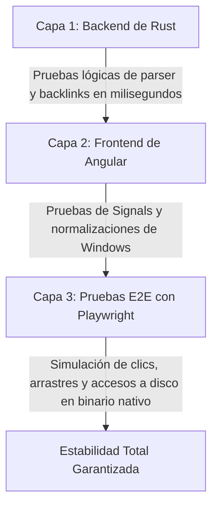
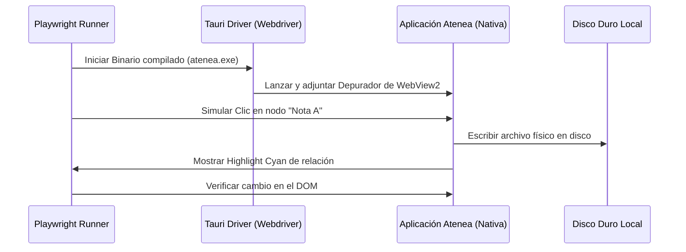

# Guía de Pruebas y Control de Calidad: Atenea

Este documento define la **Arquitectura de Pruebas (Testing Safety Net)** del proyecto Atenea. Establece los principios, la organización de carpetas y los comandos necesarios para garantizar la estabilidad de la aplicación a medida que crece.

---

## 🗺️ Mapa de la Red de Seguridad de Pruebas

Para un software de escritorio híbrido local-first (Tauri v2 + Angular 21), la estrategia de pruebas se divide en tres niveles complementarios de control de calidad:



---

## 🦀 1. Capa 1: Pruebas Unitarias del Backend (Rust)

El núcleo lógico de indexación y parser de enlaces híbridos reside en Rust para aprovechar el máximo rendimiento y paralelismo. Las pruebas son nativas y no introducen dependencias adicionales.

### 📂 Organización en el Código
Siguiendo las mejores prácticas de la comunidad de Rust, las pruebas unitarias se ubican al final del mismo archivo que implementa la lógica en un módulo marcado con `#[cfg(test)]`.
*   **Archivo principal:** [src-tauri/src/lib.rs](file:///g:/Work-Extra/10_Personal/2026-05_atenea/01_Code/atenea/src-tauri/src/lib.rs#L531-L567)

### 🧪 Cobertura Actual
*   **`test_decode_url`**: Comprueba la decodificación correcta de secuencias url-encoded (como `%20` y `+` a espacios) en carpetas simples y anidadas.
*   **`test_extract_stem`**: Valida que el extractor de nombres base obtenga la firma limpia de la nota destino, omitiendo archivos no-markdown (como `.png`) o rutas externas (`https://`, `mailto:`).
*   **`test_extract_links`**: Verifica que el analizador de un solo barrido procese de forma combinada WikiLinks clásicos, WikiLinks con alias y enlaces estándar de Markdown.

### 💻 Cómo Ejecutarlas
Navega a la carpeta de Tauri y corre el comando estándar de Cargo:
```powershell
cd src-tauri
cargo test
```
*Tiempo de ejecución estimado:* < 1 segundo.

---

## 🅰️ 2. Capa 2: Pruebas del Frontend (Angular & TypeScript)

El frontend gestiona la reactividad de la interfaz de usuario mediante **Angular Signals**. Las pruebas unitarias se enfocan en validar la coherencia del estado asíncrono y la normalización de barras de ruta de Windows.

### 📂 Organización en el Código
Las especificaciones de prueba se crean directamente junto al componente o servicio al que testean utilizando la extensión `.spec.ts`.
*   `src/app/core/services/file-system.service.spec.ts` (Validación de Signals de archivos).
*   `src/app/features/explorer/explorer.component.spec.ts` (Validación de visualización del árbol de carpetas).
*   `src/app/features/graph/graph.component.spec.ts` (Validación del estado del grafo D3).

### 🧪 Áreas Clave de Cobertura
- **Normalización estricta en Windows:** Comprobar que los métodos `isActive(...)` y la comparación de Signals no distingan entre barras inclinadas (`/`) y barras invertidas (`\`).
- **Reactividad de Selección:** Validar que al cambiar el valor de la signal `activeFilePath`, la signal `expandedPaths` reaccione expandiendo las carpetas correspondientes de forma limpia (Macro-task `setTimeout`).

### 💻 Cómo Ejecutarlas
Desde la raíz del proyecto:
```powershell
npm run test
```

---

## 🎭 3. Capa 3: Pruebas End-to-End (E2E) con Playwright

Las pruebas E2E son indispensables para una aplicación Tauri debido a que el WebView nativo (Webview2 en Windows, WebKit en macOS/Linux) puede diferir visualmente de los navegadores clásicos. Además, validan la frontera de comunicación **IPC (Inter-Process Communication)** entre Angular y Rust.

### 📂 Organización en el Código
Las pruebas de interacción total se estructuran en una carpeta dedicada en la raíz del repositorio:
*   `e2e/` (Carpeta de automatización Playwright).
    *   `e2e/graph.spec.ts` (Testea arrastres del grafo y clics en nodos).
    *   `e2e/sidebar.spec.ts` (Testea arrastre físico y colapso de la barra lateral).
    *   `e2e/editor.spec.ts` (Testea el guardado real de archivos en el disco y autoguardado).

### 🧪 Arquitectura de Ejecución E2E
Playwright automatiza la aplicación ejecutándola directamente desde el binario compilado de Tauri:



### 💻 Cómo Ejecutarlas
1.  Compilar la aplicación en modo desarrollo/pruebas:
    ```powershell
    npm run build
    ```
2.  Ejecutar el set de pruebas de Playwright:
    ```powershell
    npx playwright test
    ```

---

## 🚦 Reglas de Oro para Mantener la Estabilidad de Atenea

1.  **Pruebas antes de Empujar (Pre-commit checklist):** Siempre ejecuta `cargo test` antes de enviar cambios al repositorio.
2.  **Paridad de Entornos:** Siempre normaliza las rutas de archivo a forward slashes (`/`) en el frontend antes de enviarlas o compararlas, asegurando que las pruebas corran igual en Windows, macOS o Linux.
3.  **No Mockees el WebView:** En pruebas E2E, siempre testea el comportamiento sobre el WebView real usando el controlador de Tauri, no simules la app dentro de una pestaña web estándar de Chrome.
